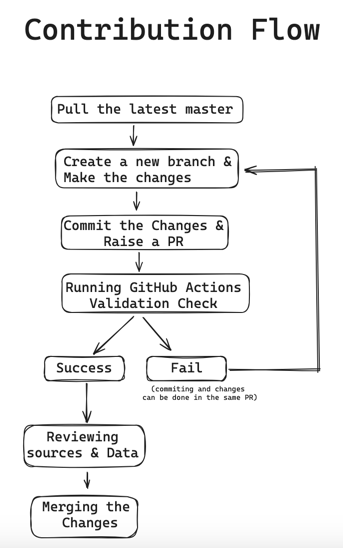

# i18nify-data Contribution Guidelines

Thank you for contributing to i18nify-data! 🎉

Please go through the below document before addition, deletion or updation of data and provide necessary information, to ensure you've reviewed this document to provide us with the necessary details for a prompt response
## Before Contributing

Before contributing a new data or the modifications to the existing data, please go through previous versions of data and ensure the modification that you're providing is never addressed.

### Source Reliability

There is no specific standards to specify that a source is standard as the data is very vast. But there are some factors that can be considered which make the source more reliable.

They are:

* The source is released by the government.
* The source is released by any esteemed organisation.
* The data is being updated periodically and well maintained by the source.
* The Number of data usages from the source.
* The data in the source is Upto Date.
* Examples:
  * ISO stndards
  * CIA world factbook
  * Maxmind
  * Google's libPhoneNumber library

## Contribution Flow:

### Contribution Guidelines:

1) **Source Reliability:**
   *  Make sure that the source that you're referring is reliable, based on the factors mentioned in the Source Reliability section.
2) **Versioning Policy:**
    * Before making a new version, please go through this [versioning policy](versioning-policy.md) guidelines.
2) **Description File:**
    * Add a Description file in the format specified, so that we have all the information needed for review
    * Make sure the `Description.md` file contains the following mandatory fields
      * Source of the Data
      * Author
      * Relavent descriptions for the Fields in Data
      * Version based on the [versioning policy](versioning-policy.md)
3) **Schema Updates:**
    * When adding a new field to the schema and making it required, add the field name to the array containing all required fields in `scheme.json`.
4) **Data and Schema Validation:**
    * Please, ensure that the data in the newer version aligns with the schema of the corresponding version.
    * We run the validation check in the form of github actions to cross the data file with the schema file.
5) **Addition/Deleting in data/country-zipcode folder**
    * When trying to Add a new Country Zipcode data (or) Delete an existing Country zipcode data, Make sure you modify the `available_countries` array in the `data/scripts/dataValidate.ts` file, to run the validation script
    * Eg:
      * If you Add a new country Afghanistan Data, modify
        * `const available_countries = ['IN', 'US', 'MY', 'SG'];` to `const available_countries = ['IN', 'US', 'MY', 'SG','AF'];`
      * If you Delete an existing country Singapore Data, modify
          * `const available_countries = ['IN', 'US', 'MY', 'SG'];` to `const available_countries = ['IN', 'US', 'MY'];`

Please adhere to these guidelines to maintain consistency and integrity within the repository. Your contributions are greatly appreciated!
