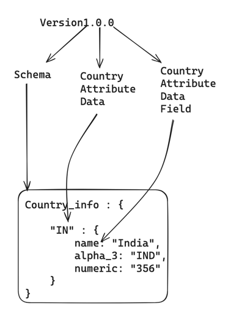
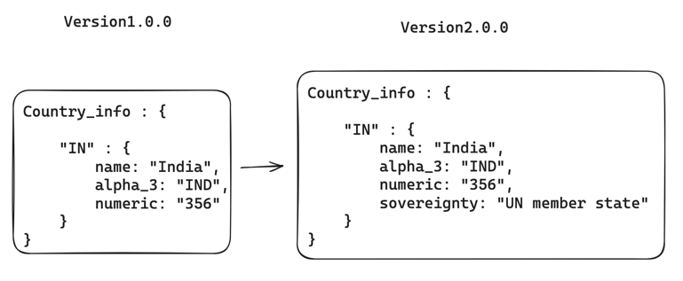
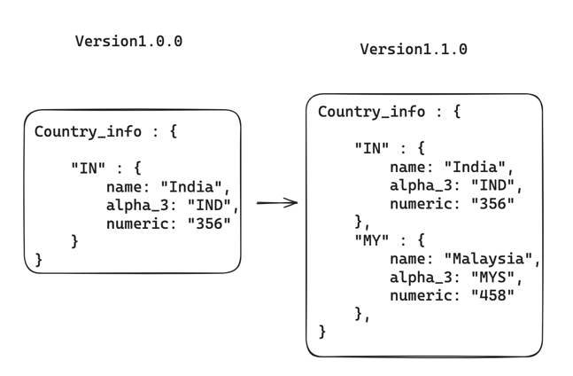
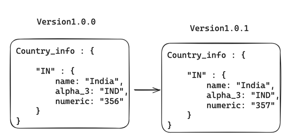

# i18nify-data Package Versioning

The i18nify-data repo is not tagged or versioned overall. Individual Country Attributes within the package are versioned directly and independently.

## Versioning Policy

We follow [SemVer](https://semver.org/) for version. version`major.minor.patch`

The versioning is maintained in the format of `version1.0.2`, in which the first part represents the scheme of data, second part represents the contry attribute data, and the third part represents the country attribute field value.

## Developer How To

There are 3 different scenarios while versioning a new release

* Schema Updation
* Data Addition
* Patching Existing Data

### 1. Scheme Updation

* In this, You can change the overall scheme of the country attribute information by adding, deleting or updating the country attribute data fields.
* Make sure to update the version from `version1.0.0` to `version2.0.0` in this scenario.
* Example of this scenario:
  * 
  * Due to a new field addition, there is a change of country_info attribute schema.

### 2. Data Addition / Updation

* In this, You can change the country attrtibute data by adding, deleting or updating the country attribute data, without updating any schema.
* Make sure to update the version from `version1.0.0` to `version1.1.0` in this scenario.
* Example of this Scenario:
  * 
  * In the above example, there is a new data addition without any change in the schema of the country attribute.

### 3. Patching older versions

* In this, You can change update the value of any country attribute data field, without modifying schema and the overall data.
* Make sure to update the version from `version1.0.0` to `version1.0.1` in this scenario.
* Example of this scenario:
  * 
  * In the above example, there is an update in the numeric field with out any update in the schema or any update in the overall data.

